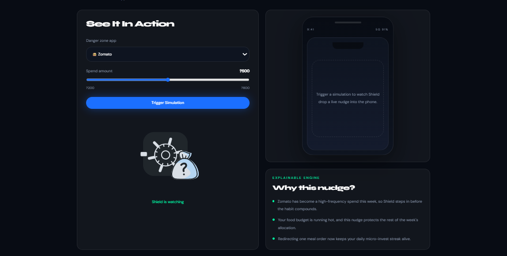
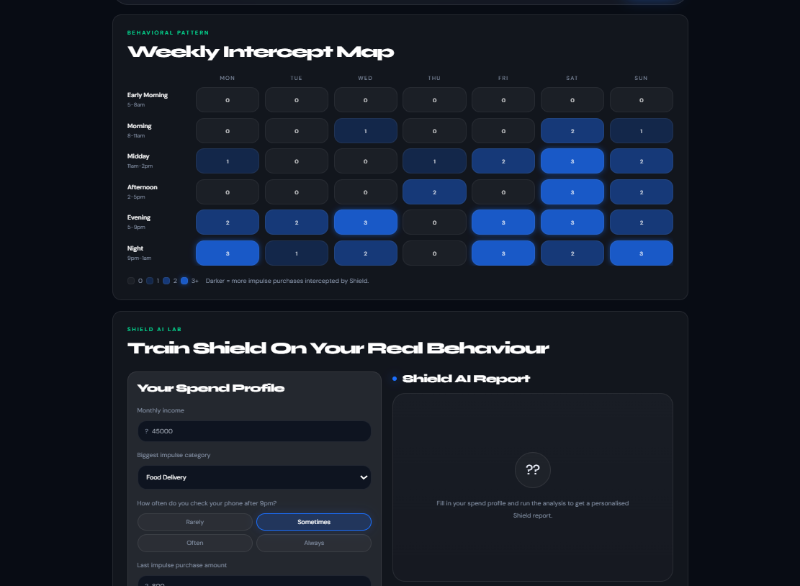
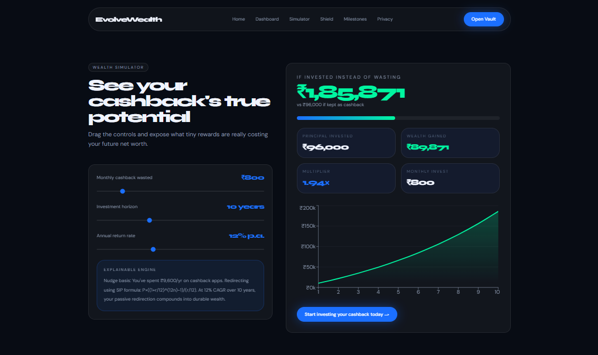
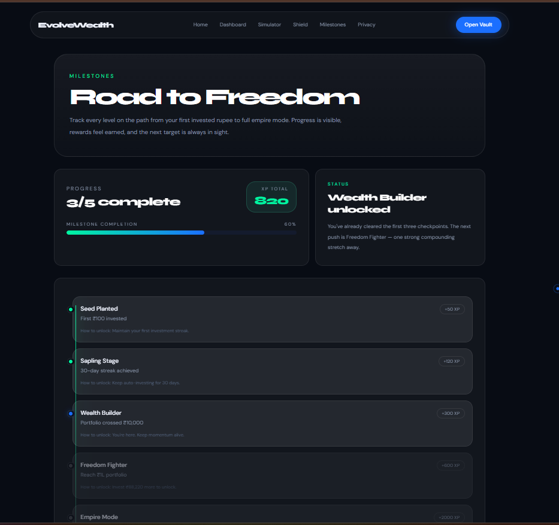
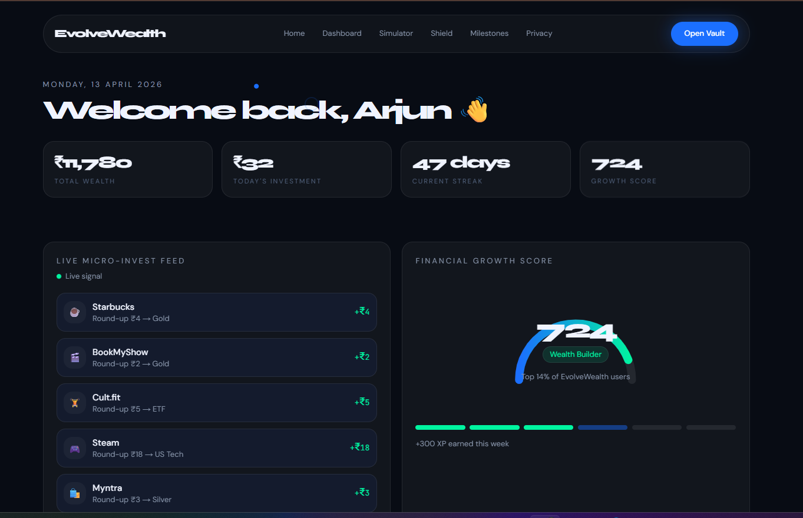

# 🚀 EvolveWealth — From Spending to Investing

> Stop collecting pennies. Start building empires.

EvolveWealth is an AI-powered behavioral finance platform that transforms everyday spending into automated micro-investments — helping users break impulsive habits and build long-term wealth.

---

## 🌍 Problem

Modern fintech apps rely heavily on **cashback rewards**, which:

* Encourage more spending ❌
* Provide short-term dopamine ⚡
* Do not contribute to real wealth growth

Users unknowingly lose **thousands in long-term wealth potential** due to impulsive spending patterns.

---

## 💡 Solution

EvolveWealth flips the system:

👉 Instead of rewarding spending, it **redirects it into investing**

* Detects impulse spending
* Intercepts transactions using “Shield”
* Converts spending into **micro-investments**
* Visualizes long-term wealth impact

---

## 🔥 Core Features

### 🛡️ Shield Mode (Impulse Protection)

* Select “danger zone” apps (Zomato, Myntra, etc.)
* Intercepts purchases before completion
* Suggests investing instead of spending

---

### 📊 Wealth Simulator

* Shows future value of small investments
* Uses SIP-based compounding logic
* Visualizes long-term wealth growth

---

### 🧠 AI Behavior Analysis (LIVE)

* Users input spending profile
* AI generates:

  * Impulse profile
  * Risk windows
  * Annual wealth drain
  * Personalized recommendations

Powered using **LLM (Anthropic API)**

---

### 📈 Intercept Heatmap

* Weekly behavior visualization
* Highlights peak impulse zones
* Helps users understand patterns

---

### 🎯 Gamified Milestones

* Progress-based system (Seed → Empire)
* XP-based engagement
* Encourages consistency and discipline

---

### 🔍 Explainable Engine

* Every nudge is explained
* Transparent decision-making
* Builds user trust

---

## 🤖 AI & Machine Learning Integration

EvolveWealth is designed as an **AI-first system**.

### ✅ Current Implementation

* LLM-powered behavioral analysis (Anthropic)
* Prompt-engineered financial insights
* Structured JSON response parsing

### 🚀 Future AI Roadmap

* 🧬 Spending Behavior Classification
  → Impulsive Buyer / Disciplined Investor

* 🔮 Predictive Nudge Engine
  → Predict when user will overspend

* 📊 Personalized Investment Strategy
  → AI-based asset allocation

* 🎮 Adaptive Gamification
  → Dynamic milestones based on behavior

* 🚨 Anomaly Detection
  → Detect unusual spending spikes

---

## 🧠 How It Works

1. User selects high-risk apps
2. User attempts a purchase
3. Shield intercepts transaction
4. System calculates future value of money
5. AI analyzes behavior patterns
6. Dashboard updates:

   * Wealth
   * Score
   * Streak
7. User is nudged toward investing

---
## 🖥️ Screenshots

### 🏠 Landing Page


### 🛡️ Shield Mode


### 🧠 AI Report


### 📊 Simulator


### 🎯 Milestones


---

## 🧪 Demo Flow

1. Open homepage
2. Go to Shield tab
3. Select danger apps
4. Run simulation
5. Fill AI form and generate report
6. Explore simulator
7. View milestones

---

## 🛠️ Tech Stack

* **Frontend:** Next.js, React, Tailwind CSS
* **State Management:** Zustand
* **Animations:** Framer Motion
* **AI Integration:** Anthropic API (Claude)
* **Charts & Visualization:** Custom + Chart.js
* **Architecture:** Component-based modular design

---

## 📂 Project Structure

```
/app
  /dashboard
  /simulator
  /shield

/components
  → UI components

/lib
  → Business logic

/state
  → Zustand store

/types
  → TypeScript definitions
```

---

## ⚙️ Installation & Setup

```bash
git clone https://github.com/Rubal06/evolvewealth.git
cd evolvewealth
npm install
npm run dev
```

---

## 🔐 Environment Variables

Create a `.env` file:

```
NEXT_PUBLIC_ANTHROPIC_API_KEY=your_api_key
```

---

## 🌟 Why EvolveWealth?

| Traditional Apps    | EvolveWealth           |
| ------------------- | ---------------------- |
| Reward spending     | Redirect spending      |
| Short-term cashback | Long-term wealth       |
| Passive tracking    | Active behavior change |

---

## 🚀 Future Scope

* Real-time bank integration
* Mobile app (React Native)
* Reinforcement learning for nudges
* Social investing & leaderboards

---

## 👨‍💻 Team

**Team Name:** QuadraTech

**Members:**
- Rubal (Role - Frontend / Backend / AI)
- Harshita (Backend Development)
- Manvi (Research, Testing & AI Strategy)
- Pranjli (UI/UX Design)

---

## 💬 Final Thought

> “Don’t reward spending. Reward discipline.”

EvolveWealth is not just a product — it’s a **behavioral shift**.
